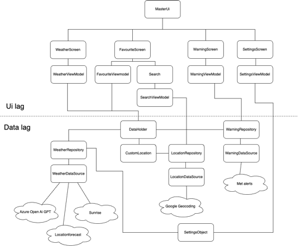

**Designmønster og dataflyt**
Appen baserer seg på “MVVM”-mønsteret. Dette mønsteret består av tre kjernekomponenter: Model, View
og Viewmodel, der hver komponent har sitt eget ansvarsområde. Vi følger også udf (unidirectional
dataflow) for dataflyt. Ui sender events (knappetrykk, skrivefelt, slider osv.) ned til viewmodelen,
og viewmodelen sender states til ui-et. Dette innkapsulerer state i viewmodel og sørger for 
"one source of truth" for state-en til ui-et. For dataflyt bruker vi hovedsakelig StateFlow i koden 
vår (asStateFlow() og collectAsState()).

**Ui laget:**
Master UI er en Compose funksjon med en horizontal pager som inneholder alle skjermene, og 
bottombar-en beskrevet over. Hver skjerm har hver sin viewmodel som blir opprettet i MainActivity.
Vi har valgt å hoiste til viewmodel-ene MainActivity for at samme skjerm skal ha samme viewmodel til
enhver tid, i stedet for at den blir opprettet på nytt hver gang man navigerer. For å gjøre de ulike
compose funksjonene mer uavhengige og testbare, har vi valgt å sende lambda funksjoner
(i stedet for viewmodel-ene) nedover. Hver skjerm er også helt uavhengig av de andre. 
Dersom f.eks. vær-apiet feiler, så kan fortsatt Farevarsel-skjermen vise farevarsler. Eller dersom
man mangler internett, vil man fortsatt kunne endre på innstillinger, siden dette ikke krever
internetttilkobling. Dette er for å følge prinsippet om lav kobling. For å følge prinsippet om høy
kohesjon, er hver komponent også kun ansvarlig for sine egne arbeidsoppgaver. Farevarsel skjermen
er f.eks. ikke ansvarlig for api-kall til hjem skjermen.

**Datalaget:**
I datalaget finner man blant annet klassen DataHolder. DataHolder er et knutepunkt for all data til 
en lokasjon. Det vil si at dersom man ønsker å se været for f.eks. Bergen, vil det bli opprettet et
DataHolder objekt for Bergen. Dette er for å samle dataene fra de ulike api-ene på ett sted. Det er
også fordi både favoritt-skjermen og hjem-skjermen skal ha tilgang til den samme dataen, slik at man
ikke trenger et nytt api-kall for hver skjerm. DataHolder har tilgang til alle repositoryene som 
trengs til hjem-skjermen.
Vi har likevel oppnådd lav kobling ved å gjøre dataene fra de ulike api-ene uavhengig av hverandre.
Dersom f.eks. Sunrise api-et feiler, vil fortsatt hjemskjermen kunne vise data fra Location Forecast
api-et. Favorittskjermen vil også kunne vise hvilke posisjoner som er lagret, selv om den 
mangler data.

**Api-nivå**
Vi har valgt API-nivå 28. Vi ønsket en balanse mellom å være kompatibel med mange enheter og å kunne
benytte moderne Android funksjonalitet. Vi vektla mest sistnevnte fordi vi ønsket en nyere versjon
av Android og ikke være begrenset av mangel på funksjoner. Samtidig ønsket vi en stabil versjon, og
de aller nyeste kan være litt upålitelige fordi de ikke har blitt testet i like stor grad.
API-nivå 28 føltes derfor som et trygt valg. Det kan benyttes av 90,3% av Android-enheter og
tilsvarerAndroid 9 (Pie) som ble lansert i 2018 (Android API Levels, 2024). Det møter også
Google Play sine minimumskrav til API-nivå for app-oppdateringer.

