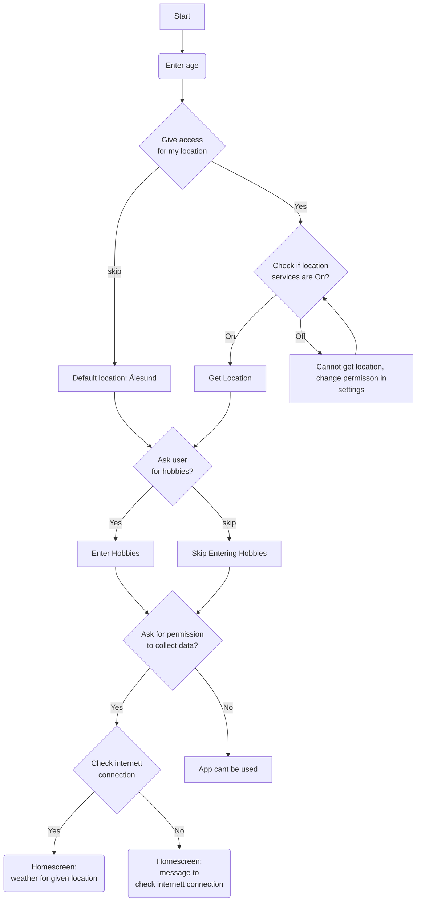

```mermaid
    flowchart TD
    A[Start] --> B(Enter age)
    B--> C{Give access \n for my location}
    C-->|Yes| D{Check if location \n services are On?}
    C -->|skip| E[Default location: Ålesund]
    D -->|On| F[Get Location]
    D -->|Off| G[Cannot get location, \n change permisson in settings]
    
    G -->D
    E --> H{Ask user\n for hobbies?}
    F --> H
    H -->|Yes| I[Enter Hobbies]
    H -->|skip| J[Skip Entering Hobbies]
    I --> K{Ask for permission\n to collect data?}
    J --> K
    K -->|Yes| L{Check internett \n connection }
    K -->|No| M[App cant be used]
    L-->|Yes| N(Homescreen: \n weather for given location )
    L-->|No| O(Homescreen: \n message to \n check internett connection )
```
