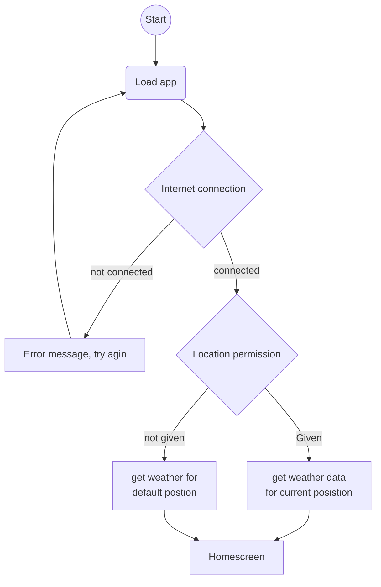

```mermaid
   flowchart TD
       Start((Start)) --> Open(Load app)
        Open --> Internet{Internet connection}
        Internet -->|not connected| Ask[Error message, try agin] --> Open
        Internet -->|connected| Loc
        Loc{Location permission}
        Loc -->|not given| Def
        Loc -->|Given| E[get weather data \n for current posistion] --> Home
        Def[get weather for \n default postion] --> Home
        Home[Homescreen]
```