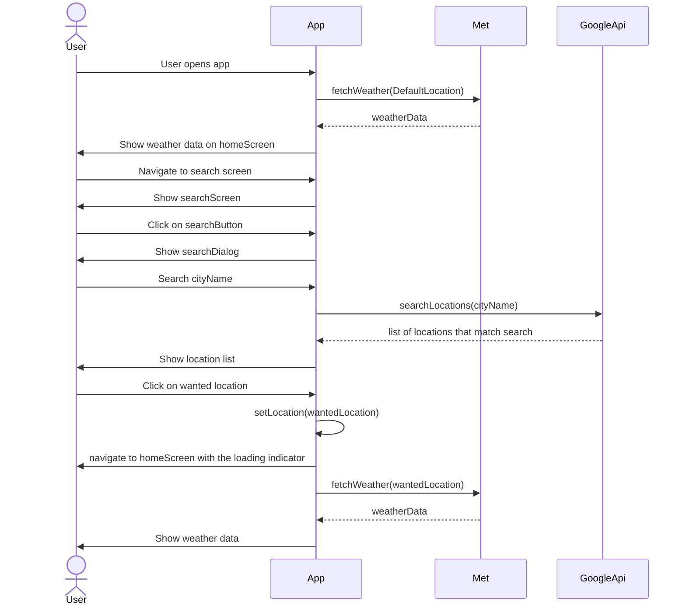

```mermaid
    sequenceDiagram
        actor U as User
        U ->>App: User opens app
        App ->> Met: fetchWeather(DefaultLocation)
        Met -->> App: weatherData
        App ->> U: Show weather data on homeScreen
        U->>App: Navigate to search screen
        App->>U: Show searchScreen
        U->>App: Click on searchButton
        App->>U: Show searchDialog
        U->>App: Search cityName
        App->>GoogleApi: searchLocations(cityName)
        GoogleApi-->>App: list of locations that match search
        App->> U: Show location list
        U->>App: Click on wanted location
        App->>App: setLocation(wantedLocation)
        App->>U:navigate to homeScreen with the loading indicator
        App->>Met: fetchWeather(wantedLocation)
        Met-->>App: weatherData
        App ->>U: Show weather data
```