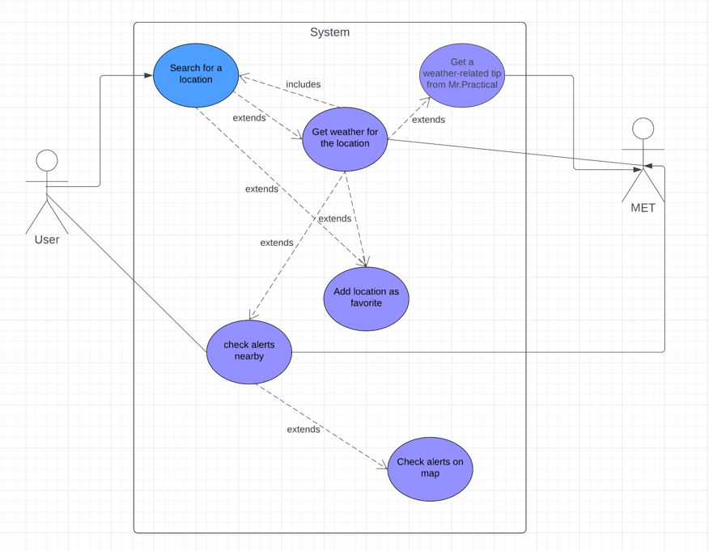
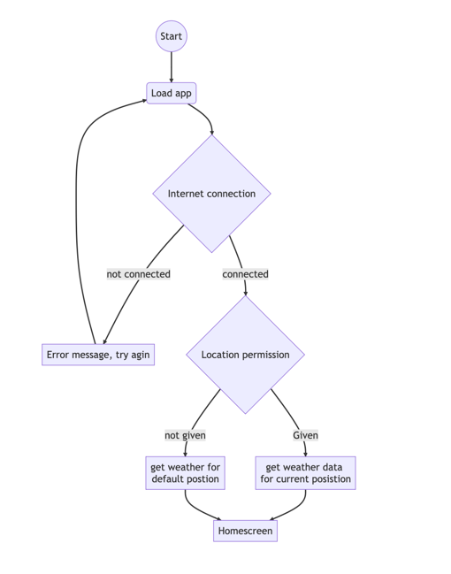

# MODELING

## Functional requirements
In this section the most important functional requirements from our requirement specification
are represented with use-cases and a sequence diagram.

Important functions in our app:
- Check the weather for a location
- Get a weather-related tip from mr. practical
- Add a city to favorite list
- Check alerts nearby you

##USE-CASES

Use-case 1: Check the weather for a location
Actor: User
Pre-condition: User has internet-access
Post-condition: Weather-data is displayed on the Home-screen

- Description:
1. The user opens the app and is on the home-screen
2. The user navigates to the search-screen
3. The user clicks on the search-tool
4. The user writes the city-name in the searchbar
5. The user clicks on the city option.
6. The system provides weather-data for the city on the home-screen

-----------------------

Use-case 2: Get a weather-related tip from mr. practical
Actor: User
Pre-condition: Weather-data for a location is displayed on the Home-screen
Post-condition: Mr.Practical gives a weather-related tip

- Description:
1. The user clicks on Mr.Practical for a tip
2. Mr.practical generates and displays a message on the screen

----------------------

Use-case 4: Add an optional city in Norway as a favorite.
Actor: User
Pre-condition: User has internet-access
Post-condition: The city is added to the favorite-list overview

- Description:
1. The user opens the app and is on the home-screen
2. The user navigates to the search-screen
3. The user clicks on the search-tool
4. The user writes the city-name in the searchbar
5. The system displays the city as an option on the screen.
6. The user clicks on a bookmark-icon to add the city as a favorite

- Alternative flow: Checks weather-data first
5.1 The user clicks on the city option
5.2 The system provides weather-data for the city on the home-screen

---------------------
Use-case 5: Check alerts nearby you
Actor: User
Pre-condition: User has internet-access and is on the home-screen w/a location
Post-condition: The user gets alerts or message about no alerts nearby

- Description:
1.0 The home-screen displays a dropdown-box with the nearest alert(s), or a msg about no alert.

- Alternative flow: Checks alert-screen

1.1 The user navigates to alert-screen
2. The screen displays a list of all alerts, arranged by distance to user.

### USE CASE- DIAGRAM
-->These use cases are represented in a use-case-diagram:

- Should i include openAI as an actor in the use case- diagram?

#Activity diagram
Activity: Open the app for the first time

De viktigste funksjonelle kravene til applikasjonen bør beskrives
med use case diagram, samt sekvensdiagram og tekstlig beskrivelse av de viktigste use-casene.

 

- Modelleringen bør også inneholde klassediagram som reflekterer use-case og sekvensdiagrammene.

- Andre diagrammer bør også være inkludert for å få frem andre perspektiver, 
  for eksempel aktivitetsdiagram (flytdiagram) eller tilstandsdiagram.