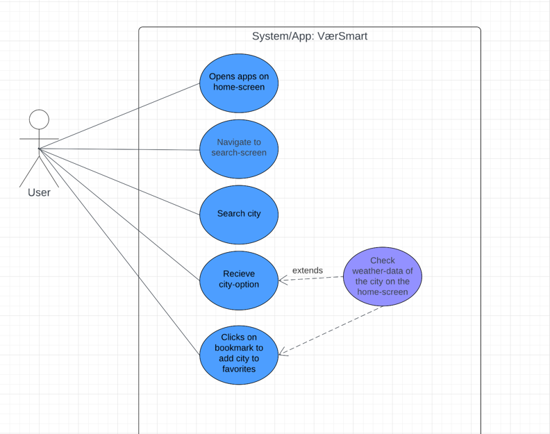

MODELING

*Functional requirements*
In this section the most important functional requirements from our requirement specification
are represented with use-cases and a sequence diagram.

Important functions in our app:
- Check the weather for a location
- Get a weather-related tip from mr. practical 
- Check alerts nearby you
- Add a city to favorite list

Use-case 1: Add an optional city in Norway as a favorite.
Actor: User
Pre-condition: User has internet-access
Post-condition: The city is added to the favorite-list overview

- Description:
1. The user opens the app and is on the home-screen
2. The user navigates to the search-screen
3. The user clicks on the search-tool
4. The user writes the city-name in the searchbar
5. The system displays the city as an option on the screen.
6. The user clicks on a bookmark-icon to add the city as a favorite

- Alternative flow: Checks weather-data first
5.1 The user clicks on the city option
5.2 The system provides weather-data for the city on the home-screen

-->This use case is represented in a use-case-diagram: 

*Activity diagram*
Activity: Open the app for the first time

De viktigste funksjonelle kravene til applikasjonen bør beskrives
med use case diagram, samt sekvensdiagram og tekstlig beskrivelse av de viktigste use-casene.

 

- Modelleringen bør også inneholde klassediagram som reflekterer use-case og sekvensdiagrammene.

- Andre diagrammer bør også være inkludert for å få frem andre perspektiver, 
  for eksempel aktivitetsdiagram (flytdiagram) eller tilstandsdiagram.